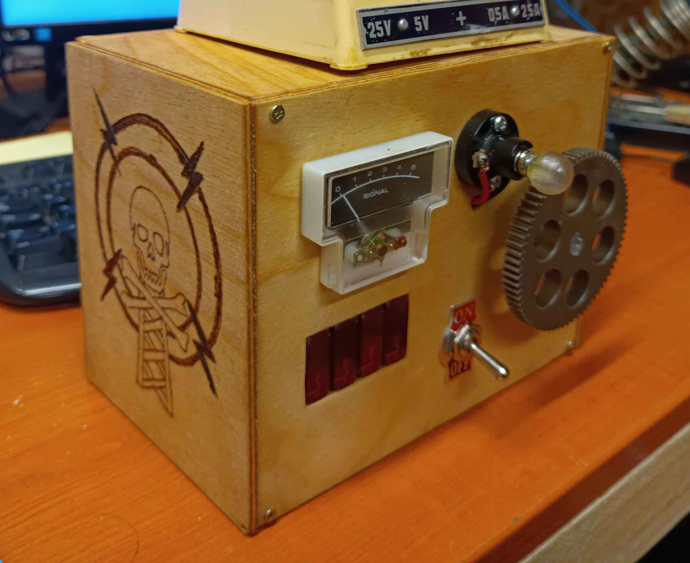

# HA5KFU mock radio

A mock radio built as an escape room prop. Controlled by a rotary encoder with a huge gear glued on, it 'receives' morse transmissions, one being the code for a lock.

Built by HA7DN in 2024
